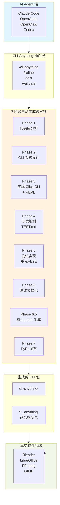
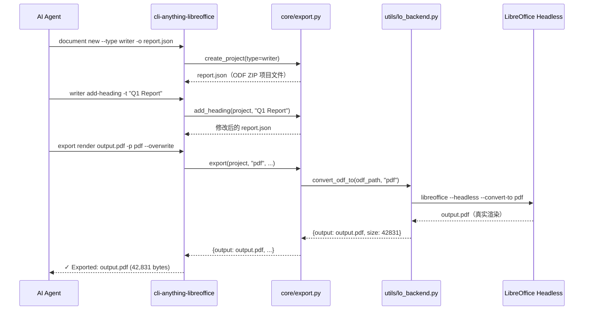

# CLI-Anything 源码解读

> 项目：HKUDS/CLI-Anything  
> 仓库：https://github.com/HKUDS/CLI-Anything  
> Stars：22,358 | Fork：1,990  
> 语言：Python  
> 许可证：Apache License 2.0  
> 分析日期：2026-03-24

---

## 一、项目概述

### 1.1 项目是做什么的

CLI-Anything 是一个**自动生成 CLI 工具链的框架**，其核心目标是：让 AI Agent 能够通过标准化的命令行接口（CLI）来控制任意开源 GUI 软件，而无需人工介入。

换句话说，它的价值主张是：

> **"今天的软件服务于人类，明天的用户将是 AI Agent。"**

### 1.2 核心问题与解决思路

| 当前痛点 | CLI-Anything 的解决方案 |
|---------|----------------------|
| AI 无法使用真正的专业软件 | 直接调用真实软件后端（Blender、LibreOffice、FFmpeg），保留完整专业能力 |
| UI 自动化（截图/点击）极其脆弱 | 无截图、无点击，纯命令行可靠性，结构化接口 |
| Agent 需要结构化数据 | 内置 `--json` 输出，机器可解析 |
| 定制集成成本高 | 一个 Claude 插件命令，自动为**任意**代码库生成 CLI |
| 原型与生产之间的差距 | 1,858 个测试覆盖，16 个主流应用的真实验证 |

### 1.3 适用场景

1. **AI Agent 驱动专业软件**：让 Agent 通过自然语言控制 Blender 渲染3D场景、控制 LibreOffice 生成 PDF/Word、控制 FFmpeg 转码视频等。
2. **自动化工作流编排**：将散落的 API、Web 服务封装成统一的有状态 CLI，一次性安装到 PATH。
3. **替代 GUI Agent**：用命令替换截图/点击方案，稳定可靠。
4. **为新软件快速生成 CLI**：只需一条 `/cli-anything <软件路径>`，自动完成从分析到测试的全流程。

---

## 二、整体架构

### 2.1 系统架构图



### 2.2 项目目录结构

```
CLI-Anything/
├── cli-anything-plugin/              # Claude Code 插件核心
│   ├── HARNESS.md                    # 方法论 SOP（最核心文档）
│   ├── repl_skin.py                  # 统一 REPL 界面
│   ├── commands/
│   │   ├── cli-anything.md           # 主构建命令
│   │   ├── refine.md                 # 扩展/改进现有 harness
│   │   ├── test.md                   # 测试运行器
│   │   └── validate.md               # 标准验证
│   └── scripts/setup-*.sh            # 各平台安装脚本
├── gimp/agent-harness/               # 各软件的 agent harness 示例
├── blender/agent-harness/
├── libreoffice/agent-harness/
├── <...>/
│   └── cli_anything/<software>/
│       ├── <software>_cli.py          # Click CLI 入口
│       ├── core/                      # 核心模块
│       │   ├── project.py             # 项目创建/打开/保存
│       │   ├── session.py             # 有状态会话、undo/redo
│       │   └── export.py              # 渲染管线 + 滤镜翻译
│       ├── utils/
│       │   ├── <software>_backend.py  # 真实软件调用封装
│       │   └── repl_skin.py           # 统一 REPL 皮肤
│       ├── skills/
│       │   └── SKILL.md               # AI Agent 可发现的技能定义
│       └── tests/
│           ├── TEST.md                # 测试计划与结果
│           ├── test_core.py            # 单元测试（合成数据）
│           └── test_full_e2e.py        # E2E 测试（真实文件+真实软件）
└── codex-skill/                      # Codex 集成
    └── openclaw-skill/               # OpenClaw 集成
    └── opencode-commands/            # OpenCode 集成
```

---

## 三、核心原理

### 3.1 七阶段自动生成流水线

#### Phase 1：代码库分析
1. 识别后端引擎（如 MLT→Shotcut/GIMP，Pillow→GIMP，bpy→Blender）
2. 映射 GUI 操作到 API 调用
3. 识别数据模型（XML、JSON、二进制、数据库）
4. 查找现有 CLI 工具（`melt`、`ffmpeg`、`convert`）
5. 梳理命令/撤销系统（通常采用 Command 模式）

#### Phase 2：CLI 架构设计
- 交互模型：**有状态 REPL**（Agent 维持上下文）+ **子命令 CLI**（脚本化/管道）
- 命令分组：`project`/`scene`/`layer`/`export` 等
- 状态模型：内存（REPL）/ 文件（CLI），通过 JSON 会话文件序列化
- 输出格式：`--json` 供机器消费，人工可读格式供调试

#### Phase 3：实现
1. 从数据层开始（XML/JSON 项目文件操作）
2. 添加 probe/info 命令（修改前先检查）
3. 添加变更命令（一个命令对应一个逻辑操作）
4. 添加后端集成（`utils/<software>_backend.py`，用 `subprocess.run` 调用真实软件）
5. 添加渲染/导出（先生成中间文件，再调用真实软件转换）
6. 添加会话管理（状态持久化、undo/redo）
7. 添加 REPL（`repl_skin.py`，统一交互体验）

#### Phase 4：测试规划（先写 TEST.md）
- 测试清单计划
- 单元测试计划
- E2E 测试计划（真实文件+真实软件）

#### Phase 5：测试实现
- 单元测试（合成数据，无外部依赖）
- E2E 测试（中间文件格式验证）
- E2E 真后端测试（**必须调用真实软件**，生成 PDF/DOCX/视频等）
- CLI 子进程测试（`subprocess.run` 测试安装后的命令）

#### Phase 6：测试文档化
- 运行 pytest，将结果追加到 TEST.md

#### Phase 6.5：SKILL.md 生成
- 使用 `skill_generator.py` 从 Click 装饰器提取元数据
- 生成包含 YAML frontmatter 的技能定义文件
- 安装后自动被 REPL banner 检测并显示路径

#### Phase 7：PyPI 发布
- 创建 `setup.py`，使用 `find_namespace_packages`
- `cli_anything/` 目录**无** `__init__.py`（PEP 420 命名空间包）
- 每个子包（如 `gimp/`）**有** `__init__.py`
- 配置 `console_scripts` 入口点，`pip install -e .` 后命令进入 PATH

### 3.2 后端集成模式

CLI-Anything 的核心设计原则是**"用真实软件，不重新实现"**。典型模式：

```python
# utils/lo_backend.py（LibreOffice 后端）
def convert_odf_to(odf_path, output_format, output_path=None, overwrite=False):
    lo = find_libreoffice()  # 找不到则抛异常（带安装指引）
    subprocess.run([lo, "--headless", "--convert-to", output_format, ...])
    return {"output": final_path, "format": output_format}

# utils/blender_backend.py
def render_blender_scene(scene_path, output_path, engine="CYCLES"):
    blender = find_blender()
    script = generate_bpy_script(scene_path)
    subprocess.run([blender, "--background", "--python", script])
    return {"output": output_path}
```

### 3.3 REPL 统一皮肤（repl_skin.py）

`ReplSkin` 类为所有生成的 CLI 提供一致的交互体验：
- 品牌化启动横幅（自动检测 `skills/SKILL.md` 并显示路径）
- 状态化提示符（含项目名、修改状态 `*`）
- 彩色消息（成功✓/错误✗/警告⚠/信息●）
- 表格和进度条输出
- 命令历史（prompt_toolkit）

```python
skin = ReplSkin("blender", version="1.0.0")
skin.print_banner()  # 显示 Skill 路径
pt_session = skin.create_prompt_session()
line = skin.get_input(pt_session, project_name="my_project", modified=True)
skin.success("Rendered: render.png")
```

### 3.4 命名空间包架构

所有生成的 CLI 使用 **PEP 420 隐式命名空间包**，共存于同一 Python 环境：

```
# cli_anything/ 无 __init__.py（命名空间根）
# cli_anything/gimp/ 有 __init__.py（gimp 子包）
# cli_anything/blender/ 有 __init__.py（blender 子包）
# 两者互不冲突，可同时安装
```

### 3.5 关键数据流（以 LibreOffice 为例）



---

## 四、关键设计思想

### 4.1 "真实软件优先"原则

> **"绝对不要重新实现渲染引擎。"**

这是 HARNESS.md 的第一条铁律。CLI-Anything 生成的是**真实软件的命令行接口**，而不是替代品。

| 反模式（错误） | 正确模式 |
|-------------|---------|
| 用 Pillow 实现 GIMP 功能 | 生成 .xcf 文件，调用 GIMP 批处理 |
| 写 Python 渲染 Blender 场景 | 生成 bpy 脚本，调用 `blender --background` |
| 用 python-pptx 生成 PPT | 生成 ODP 文件，调用 LibreOffice 转换 |

### 4.2 "渲染 Gap"问题

GUI 应用在渲染时应用效果。如果 CLI 只操作项目文件而用了简单的导出工具，效果会被静默丢失。

**解决：滤镜翻译层**
1. 优先使用原生渲染器（`melt` for MLT）
2. 退而求其次：构建翻译层（MLT 滤镜 → ffmpeg `-filter_complex`）
3. 最后手段：生成用户手动运行的渲染脚本

### 4.3 四层测试策略

```
Layer 1: 单元测试（test_core.py）
  → 合成数据，无外部依赖，快速 CI

Layer 2: E2E 原生（test_full_e2e.py）
  → 验证生成的项目文件格式正确（XML、ODF ZIP结构等）

Layer 3: E2E 真后端（test_full_e2e.py）
  → 调用真实软件，验证输出文件（PDF magic bytes、DOCX ZIP结构）

Layer 4: CLI 子进程（test_full_e2e.py TestCLISubprocess）
  → subprocess.run 测试安装后的命令，完整端到端
```

### 4.4 SKILL.md 自动生成

每个生成的 CLI 在 Phase 6.5 自动生成 `SKILL.md`：
- YAML frontmatter 供 Agent 技能发现
- 从 Click 装饰器提取命令元数据
- 使用 Jinja2 模板生成
- 安装后 REPL banner 自动显示路径

---

## 五、术语解释

| 术语 | 含义 |
|------|------|
| **Harness** | 工具马具，此处指为特定软件生成的 CLI 工具包 |
| **REPL** | Read-Eval-Print Loop，交互式命令行界面 |
| **Agent-Native** | 设计上适合 AI Agent 使用的（区别于人类使用的 GUI） |
| **SKILL.md** | AI Agent 的技能定义文件，标准化元数据格式 |
| **Namespace Package** | PEP 420 隐式命名空间包，多个独立包共存于同一命名空间 |
| **REPL Skin** | 统一的可复用 REPL 界面组件，提供品牌化 UI |
| **Backend** | 真实软件后端的 Python 封装（如 `lo_backend.py`） |
| **E2E Test** | 端到端测试，用真实文件和真实软件验证完整流程 |
| **Rendering Gap** | 渲染时效果丢失问题（GUI 在渲染时应用效果，CLI 操作文件时可能遗漏） |
| **Filter Translation** | 滤镜翻译：将一个平台的滤镜参数映射到另一个平台 |

---

## 六、多 Agent 平台支持

CLI-Anything 不绑定特定 Agent 平台，而是通过不同的"插件层"适配：

| 平台 | 集成方式 | 路径 |
|------|---------|------|
| **Claude Code** | 插件市场 (`/plugin marketplace add`) | `cli-anything-plugin/` |
| **OpenCode** | 斜杠命令 `.opencode/commands/` | `opencode-commands/*.md` |
| **OpenClaw** | 技能文件 `~/.openclaw/skills/` | `openclaw-skill/SKILL.md` |
| **Codex** | 技能目录 `$CODEX_HOME/skills/` | `codex-skill/` |
| **Qodercli** | 插件注册 `~/.qoder.json` | `qoder-plugin/setup-qodercli.sh` |
| **GitHub Copilot CLI** | 插件系统 | `cli-anything-plugin/` |

所有平台的底层都基于 **HARNESS.md 方法论**，生成的 Python 包格式完全一致。

---

## 七、优点与局限

### 优点
1. **零妥协**：使用真实软件后端，保留完整专业能力
2. **自动化程度高**：一条命令完成从分析到发布的全流程
3. **多平台兼容**：适配所有主流 AI Agent 平台
4. **测试完善**：1,858 个测试，100% 通过率
5. **可扩展性强**：命名空间包架构，添加新软件只需按 HARNESS.md 规范实现

### 局限
1. **强依赖基础模型**：需要前沿级模型（Claude Opus 4.6+、GPT-5.4+），弱模型生成质量差
2. **依赖源码**：无法处理仅提供二进制文件的软件
3. **需要迭代**：单次生成可能不完整，需要多次 `/refine` 逐步完善
4. **真实软件硬依赖**：软件未安装则 CLI 完全不可用，无优雅降级

---

## 八、值得借鉴的设计

1. **命名空间包共存**：PEP 420 架构让多个包和谐共处于同一 Python 环境
2. **文件锁写 JSON**：`_locked_save_json` 函数在写会话文件时加锁，防止并发破坏
3. **子进程测试模式**：`_resolve_cli()` 兼容开发路径和安装路径，CI 用 `CLI_ANYTHING_FORCE_INSTALLED=1` 强制验证
4. **测试先行**：Phase 4 先写 TEST.md 再实现测试，确保测试覆盖完整性
5. **渲染管线分离**：中间文件格式（ODF/MLT）和最终输出格式（PDF/MP4）分阶段处理
6. **Skill 可发现性**：SKILL.md 放在包内随 `pip install` 自动分发，REPL banner 自动显示路径
