> Droidrun 是一个通过 LLM Agent 控制 Android/iOS 设备的开源框架，允许用户通过自然语言命令自动化设备交互。
>

---

## 目录
+ [一、项目概述](#一项目概述)
+ [二、整体架构总览](#二整体架构总览)
+ [三、多 Agent 架构详解](#三多-agent-架构详解)
    - [3.1 Reasoning 模式](#31-reasoning-模式)
    - [3.2 Direct 模式](#32-direct-模式)
    - [3.3 Agent 角色对比](#33-agent-角色对比)
+ [四、AI 操作手机的完整流程（核心）](#四ai-操作手机的完整流程核心)
    - [4.1 初始化阶段](#41-初始化阶段)
    - [4.2 感知阶段 -- 获取设备状态](#42-感知阶段----获取设备状态)
    - [4.3 决策阶段 -- LLM 推理](#43-决策阶段----llm-推理)
    - [4.4 UI 元素定位机制](#44-ui-元素定位机制)
    - [4.5 操作执行机制](#45-操作执行机制)
    - [4.6 循环与终止](#46-循环与终止)
+ [五、关键技术设计](#五关键技术设计)
    - [5.1 Portal App](#51-portal-app)
    - [5.2 双通信通道](#52-双通信通道)
    - [5.3 状态重试与恢复](#53-状态重试与恢复)
    - [5.4 ToolRegistry 统一分发](#54-toolregistry-统一分发)
    - [5.5 llama-index Workflow 事件驱动编排](#55-llama-index-workflow-事件驱动编排)
+ [六、依赖与技术栈](#六依赖与技术栈)
+ [七、适用场景与局限](#七适用场景与局限)

---

## 一、项目概述
Droidrun 的核心理念是：**用自然语言驱动手机操作**。用户只需描述想要完成的任务（如"打开微信给张三发一条消息"），框架会通过 LLM 进行推理、规划、拆解，并最终通过 ADB 和设备端辅助应用（Portal App）在真实 Android 设备上执行 UI 操作。

其关键能力包括：

+ 多 Agent 协作架构（Manager、Executor、Scripter、FastAgent 等）
+ 两种执行模式：深度推理（Reasoning）与快速直连（Direct）
+ 基于 Accessibility Service 的 UI 感知（无障碍树）
+ 基于 ADB 的底层操作执行（tap、swipe、keyevent 等）
+ 支持多种 LLM 后端（OpenAI、Anthropic、Google Gemini、Ollama、DeepSeek、OpenRouter）

---

## 二、整体架构总览
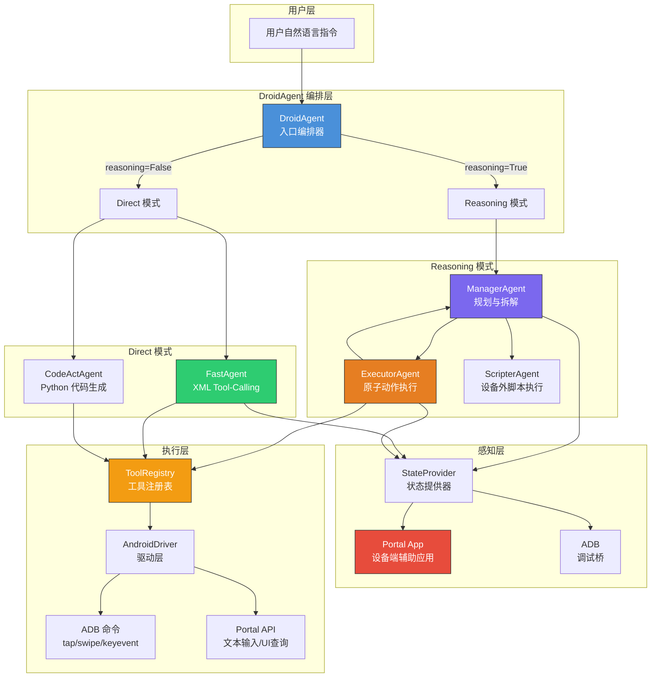

---

## 三、多 Agent 架构详解
DroidAgent 是整个框架的入口编排器，它根据 `reasoning` 参数选择不同的执行模式。

### 3.1 Reasoning 模式
当 `reasoning=True` 时，采用 **Manager-Executor 循环**，适合复杂多步骤任务。

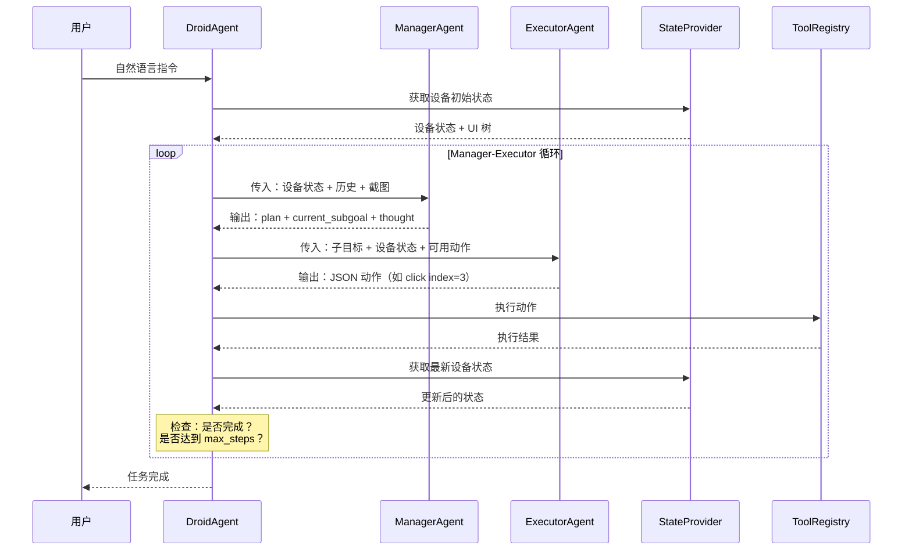

#### ManagerAgent（管理者）
+ **职责**：高层规划，分析当前设备状态和执行历史，创建总体计划并拆分为子目标
+ **输入**：系统 Prompt + 设备状态文本 + 截图（可选） + 历史记录
+ **输出**：
    - `plan`：总体计划描述
    - `current_subgoal`：当前需要完成的子目标
    - `thought`：推理过程说明
    - `answer`：任务完成时的最终回答（通过 `<request_accomplished>` 标签触发终止）
    - `memory_update`：记忆更新内容
    - `success`：是否已完成标记

#### ExecutorAgent（执行者）
+ **职责**：执行单个原子动作，是**单轮 Agent**（不保留跨轮上下文）
+ **输入**：当前子目标 + 设备状态 + 可用动作签名列表
+ **输出**：一个 JSON 格式的动作描述，例如：

```json
{"action": "click", "index": 3}
```

#### ScripterAgent（脚本执行者）
+ **职责**：在设备外执行 Python 脚本，用于 API 调用、文件操作等非 UI 交互任务
+ **触发条件**：当 Manager 输出的 `current_subgoal` 包含 `<script>` 标签时，自动路由到 ScripterAgent
+ **特点**：不与设备 UI 直接交互，采用 ReAct 多轮循环，有自己的 message_history 和 step_counter

#### TextManipulatorAgent（文本操作者）
+ **职责**：专门处理文本编辑任务，当输入框有焦点文本且需要文本操作时触发
+ **触发条件**：当 Manager 输出的 `current_subgoal` 以 `TEXT_TASK` 前缀开头，且 `codeact` 模式开启时路由到此 Agent

### 3.2 Direct 模式
当 `reasoning=False` 时，跳过 Manager-Executor 分层，由单个 Agent 直接完成感知与执行。

#### FastAgent
+ 使用 **XML tool-calling 协议**
+ 采用 **ReAct 循环**：`Thought → Tool Call → Observation → repeat`
+ 输入：系统 Prompt（含 XML tool 描述）+ 设备状态 + 截图
+ 输出：思考文本 + `<function_calls>` XML 块
+ XML 解析器从输出中提取 `tool_calls`

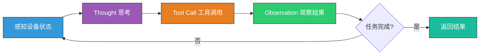

#### CodeActAgent
+ 生成 Python 代码片段并在运行时执行
+ 适合需要编程逻辑（条件判断、循环等）的复杂操作场景

### 3.3 Agent 角色对比
| Agent | 模式 | 职责 | 输出格式 | 上下文 |
| --- | --- | --- | --- | --- |
| ManagerAgent | Reasoning | 规划与拆解 | plan + subgoal + thought + answer | 保留历史 |
| StatelessManagerAgent | Reasoning | 无状态规划（每轮重建完整上下文） | 同上 | 每轮重建 |
| ExecutorAgent | Reasoning | 执行原子动作 | JSON 动作 + outcome + summary | 单轮，无历史 |
| ScripterAgent | Reasoning | 设备外脚本执行 | Python 脚本结果 | ReAct 循环 |
| TextManipulatorAgent | Reasoning | 文本编辑操作 | 文本操作结果 | ReAct 循环 |
| FastAgent | Direct | 感知+决策+执行 | XML tool_calls | ReAct 循环 |
| CodeActAgent | Direct | 代码生成执行 | Python 代码 | ReAct 循环 |


---

## 四、AI 操作手机的完整流程（核心）
这是 Droidrun 最核心的部分，描述了从用户输入自然语言到手机屏幕上产生真实操作的完整链路。

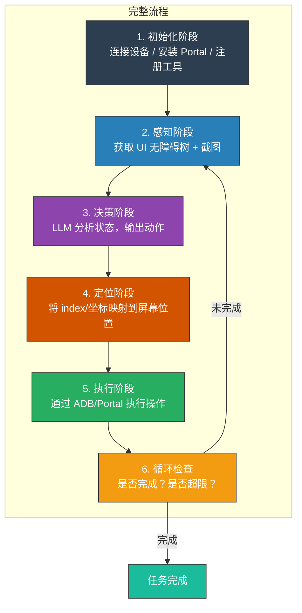

### 4.1 初始化阶段
初始化在 `DroidAgent.__init__()` 和 `start_handler()` 中完成，分为以下步骤：

```plain
DroidAgent.__init__()
├── 加载配置（LLM 类型、模型参数、最大步数等）
├── 初始化 LLM 实例（支持 7 种角色独立配置：manager、executor、fast_agent、
│   text_manipulator、app_opener、scripter、structured_output）
├── 仅当 reasoning=True 时，创建 ManagerAgent（或 StatelessManagerAgent）和 ExecutorAgent
└── FastAgent / CodeActAgent 不在此创建，而是每次运行时按需创建

start_handler()
├── a) 创建 Driver（AndroidDriver 或 IOSDriver，可包装 StealthDriver/RecordingDriver）
├── b) 创建 StateProvider（AndroidStateProvider 或 IOSStateProvider）
├── c) 构建 ToolRegistry（注册原子工具 + open_app + remember + complete +
│      可选的 credential 工具 + 用户自定义工具 + MCP 工具，
│      并根据 driver/state_provider 能力禁用不支持的工具）
├── d) 创建 ActionContext（封装 driver、ui、shared_state）
├── e) 将 ActionContext、StateProvider、ToolRegistry 注入到已创建的子 Agent
└── f) 路由分发：reasoning=False → FastAgentExecuteEvent；reasoning=True → ManagerInputEvent
```

**关键对象说明**：

| 对象 | 职责 |
| --- | --- |
| `AndroidDriver` / `IOSDriver` | 封装 ADB/设备通信，提供 tap/swipe/keyevent 等底层操作 |
| `Portal APK` | 设备端辅助应用，通过 Accessibility Service 获取 UI 树 |
| `AndroidStateProvider` / `IOSStateProvider` | 获取并格式化设备状态，供 LLM 消费 |
| `ToolRegistry` | 统一管理和分发所有可用工具（click、type、swipe 等），初始化时根据设备能力禁用不支持的工具 |
| `ActionContext` | 上下文容器，封装 driver、UI 状态、共享状态 |


### 4.2 感知阶段 -- 获取设备状态
感知阶段是 AI 理解手机当前屏幕内容的关键环节。

#### 核心调用链路
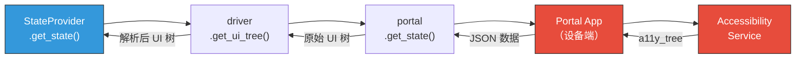

#### 详细过程
**Step 1 - Portal App 采集 UI 信息**

Portal App 是安装在 Android 设备上的辅助应用，它通过 Android **Accessibility Service**（无障碍服务）获取完整的 UI 无障碍树（a11y_tree）。返回的原始数据包含：

| 数据字段 | 说明 |
| --- | --- |
| `a11y_tree` | 完整的 UI 无障碍树，包含所有可见元素 |
| `phone_state` | 手机状态（电量、网络、屏幕亮度等） |
| `device_context` | 设备上下文信息（屏幕尺寸、方向等） |


**Step 2 - 通信方式**

Portal App 与主机之间有两种通信通道：

| 通道 | 方式 | 特点 |
| --- | --- | --- |
| **TCP（优先）** | ADB 端口转发 + HTTP 请求 | 速度更快，适合常规通信 |
| **Content Provider（兜底）** | ADB shell 命令 | 兼容性更好，作为 TCP 失败时的后备方案 |


**Step 3 - UI 树过滤**

原始 a11y_tree 经过 `TreeFilter` 过滤，移除不必要的元素：

+ `ConciseFilter`：精简模式，移除屏幕外元素（与屏幕无交集）和过小元素（小于 5px 阈值）
+ `DetailedFilter`：详细模式，按可见面积百分比过滤（低于 10% 的元素被移除），支持键盘元素过滤和 bounds 裁剪

**Step 4 - UI 树格式化**

过滤后的 UI 树经过 `IndexedFormatter` 格式化处理：

1. 将树形结构**扁平化**
2. 为每个元素分配**递增的 index**（从 1 开始）
3. 提取关键属性：`className`、`resourceId`、`text`、`bounds`（边界坐标）
4. 生成 LLM 可读的格式化文本

**格式化输出示例**：

```plain
1. Button: "Wi-Fi" - (0,100,1080,200)
2. TextView: "已连接" - (0,200,1080,260)
3. Button: "Settings" - (100,300,500,400)
4. EditText: "Search..." - (50,420,1030,500)
5. ImageButton: "Back" - (0,0,100,80)
```

**Step 5 - 截图（可选）**

截图获取有两种方式：

+ **TCP 模式（优先）**：通过 Portal HTTP 接口 `GET /screenshot` 获取 Base64 编码的 PNG 截图
+ **ADB 模式（兜底）**：TCP 失败时回退到 ADB `screencap` 命令直接截图

> 注意：截图不使用 Content Provider 通道，只有 TCP 和 ADB screencap 两种方式。
>

### 4.3 决策阶段 -- LLM 推理
#### Reasoning 模式的决策流程
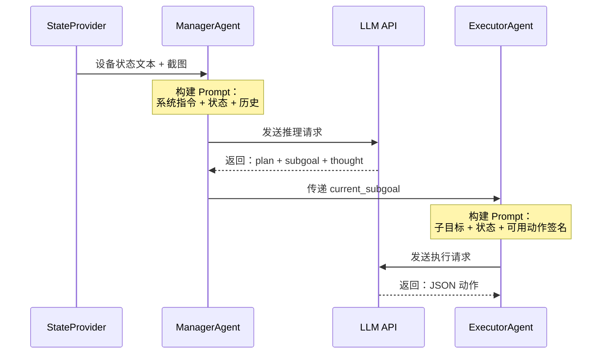

**Manager 的输入与输出**：

```plain
输入:
  - 系统 Prompt（角色定义、规则约束）
  - 设备状态文本（格式化的 UI 树）
  - 截图（可选，多模态）
  - 历史记录（之前的动作和结果）

输出:
  - plan: "1. 打开设置 2. 找到 Wi-Fi 3. 开启 Wi-Fi"
  - current_subgoal: "点击设置按钮进入设置页面"
  - thought: "当前屏幕是主页，需要先打开设置应用"
```

**Executor 的输入与输出**：

```plain
输入:
  - 子目标: "点击设置按钮进入设置页面"
  - 设备状态: "3. Button: 'Settings' - (100,300,500,400)"
  - 可用动作签名: ["click(index)", "type(text, index)", "swipe(...)", ...]

输出:
  {"action": "click", "index": 3}
```

#### Direct 模式的决策流程
FastAgent 将感知与决策融为一体：

```plain
输入:
  - 系统 Prompt（含 XML tool 描述）
  - 设备状态文本
  - 截图（可选）

LLM 输出示例:
  <thought>
    屏幕上第 3 个元素是 Settings 按钮，点击它可以进入设置
  </thought>
  <function_calls>
    <invoke name="click">
      <parameter name="index">3</parameter>
    </invoke>
  </function_calls>

```

XML 解析器从输出中提取 `tool_calls`，然后通过 ToolRegistry 执行。

### 4.4 UI 元素定位机制
定位是连接 LLM 决策与物理操作的桥梁。Droidrun 提供多种定位策略：

#### 基于索引（index）定位 -- 主要方式
这是最常用的定位方式，流程如下：

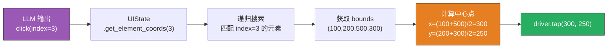

**工作原理**：

1. 每个可见 UI 元素在 `IndexedFormatter` 中被分配一个从 1 开始的递增 index
2. 元素信息包含 `bounds` 坐标：`(left, top, right, bottom)`
3. LLM 看到的是：`3. Button: "Settings" - (100,200,500,300)`
4. LLM 返回：`click(index=3)`
5. `UIState.get_element_coords(index)` 递归查找匹配 index 的元素
6. 计算 bounds 的中心点：

```python
center_x = (left + right) // 2   # (100 + 500) // 2 = 300
center_y = (top + bottom) // 2   # (200 + 300) // 2 = 250
```

#### 基于坐标定位
+ `click_at(x, y)`：直接使用屏幕坐标，支持归一化坐标（0~1000 整数范围，`NORMALIZED_MAX=1000`）到实际像素坐标的转换
+ `click_area(x1, y1, x2, y2)`：指定一个区域，自动计算区域中心点后点击

#### 高级定位（element_search.py）
`Filters` 类（位于 `tools/helpers/element_search.py`）提供强大的组合式搜索能力：

| 类别 | 方法 | 说明 |
| --- | --- | --- |
| **文本匹配** | `text_matches(pattern)` | 按文本内容匹配 |
| **ID 匹配** | `id_matches(resource_id)` | 按 resourceId 匹配 |
| **空间关系** | `below(anchor_filter)` | 在某元素下方（参数为 `ElementFilter`） |
|  | `above(anchor_filter)` | 在某元素上方 |
|  | `left_of(anchor_filter)` | 在某元素左侧 |
|  | `right_of(anchor_filter)` | 在某元素右侧 |
| **属性过滤** | `clickable()` | 可点击元素 |
|  | `non_clickable()` | 不可点击元素 |
|  | `enabled()` | 已启用元素 |
|  | `selected()` | 已选中元素 |
|  | `checked()` | 已勾选元素 |
|  | `focused()` | 已聚焦元素 |
|  | `has_text()` | 包含文本内容的元素 |
| **尺寸匹配** | `size_matches(width, height, tolerance)` | 按尺寸匹配 |
| **层级关系** | `contains_child(filter)` | 包含特定子元素 |
|  | `contains_descendants(filters)` | 包含特定后代元素 |
|  | `child_of(filter)` | 是特定元素的子元素 |
| **智能选择** | `deepest_matching()` | 最深层匹配 |
|  | `clickable_first()` | 优先选择可点击元素 |
|  | `index(idx)` | 按索引选择 |
| **组合操作** | `compose(filters)` | 组合多个过滤器（逻辑与） |
|  | `intersect(filters)` | 多过滤器交集 |


这些过滤器可以链式组合使用，实现精确的元素定位。

### 4.5 操作执行机制
所有操作通过 `ToolRegistry.execute()` 统一分发。以下是各类操作的完整执行链路：

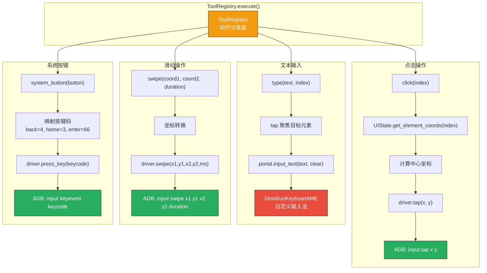

#### 点击操作
| 方法 | 执行链路 |
| --- | --- |
| `click(index)` | `UIState.get_element_coords(index)` -> 计算中心坐标 -> `driver.tap(x, y)` -> ADB `input tap x y` |
| `click_at(x, y)` | `UIState.convert_point()` 坐标转换 -> `driver.tap(x, y)` -> ADB `input tap x y` |
| `click_area(x1,y1,x2,y2)` | 计算区域中心点 -> `driver.tap(center_x, center_y)` |


#### 长按操作
```plain
long_press(index)
  -> 获取目标元素坐标 (x, y)
  -> driver.swipe(x, y, x, y, 1000ms)   // 原地滑动模拟长按
  -> ADB: input swipe x y x y 1000
```

> 长按通过在同一坐标进行 1000ms 的滑动来模拟，这是一种常见的 ADB 长按实现技巧。
>

#### 滑动/滚动操作
```plain
swipe(coordinate, coordinate2, duration)
  -> UIState.convert_point() 对起点和终点进行坐标转换
  -> driver.swipe(x1, y1, x2, y2, duration_ms)
  -> ADB: input swipe x1 y1 x2 y2 duration
```

#### 文本输入
```plain
type(text, index, clear=False)
  -> 当 index != -1 时，先 tap 聚焦目标输入框（通过 index 定位）
  -> 当 index == -1 时，跳过聚焦，直接向当前焦点元素输入
  -> driver.input_text(text, clear) -> portal.input_text(text, clear)
  -> Portal App 通过自定义 IME (DroidrunKeyboardIME) 输入文本
  -> 支持 base64 编码以处理特殊字符和 Unicode
  -> clear=True 时先清空输入框再输入
```

> Portal 自带的 `DroidrunKeyboardIME` 是一个自定义输入法，绕过了 ADB 原生 `input text` 命令对特殊字符和非 ASCII 文本的限制。
>

#### 系统按键
| 按键 | keycode | 说明 |
| --- | --- | --- |
| `back` | 4 | 返回键 |
| `home` | 3 | Home 键 |
| `enter` | 66 | 回车键 |


```plain
system_button(button)
  -> 按键名映射为 keycode
  -> driver.press_key(keycode)
  -> ADB: input keyevent <keycode>
```

#### 打开应用
```plain
open_app(text)
  -> AppStarter workflow 启动
  -> LLM 根据用户描述匹配应用包名
  -> driver.start_app(package_name)
  -> ADB: am start -n <package_name>/<activity>
```

#### 其他操作
| 方法 | 说明 |
| --- | --- |
| `long_press_at(x, y)` | 按坐标长按，支持归一化坐标转换 |
| `wait(duration)` | 等待指定时长（秒） |
| `remember(information)` | 将信息保存到 shared_state，供后续步骤使用 |
| `type_secret(secret_id, index)` | 安全输入凭证，通过 CredentialManager 获取密文，不暴露明文给 LLM |


### 4.6 循环与终止
每执行一步操作后，框架进入循环检查：

```mermaid
graph TD
    EXEC[执行动作完成] --> UPDATE[更新 shared_state<br/>记录历史/结果/错误计数]
    UPDATE --> CHK1{达到 max_steps?}
    CHK1 -->|是| STOP1[终止：超出最大步数]
    CHK1 -->|否| CHK2{LLM 调用了 complete()?}
    CHK2 -->|是| STOP2[终止：任务已完成]
    CHK2 -->|否| CHK3{连续错误超限?}
    CHK3 -->|是| STOP3[终止：错误过多]
    CHK3 -->|否| NEXT[回到感知阶段<br/>获取最新设备状态]
    NEXT --> LOOP[继续下一轮循环]

    style EXEC fill:#3498DB,stroke:#333,color:#fff
    style STOP1 fill:#E74C3C,stroke:#333,color:#fff
    style STOP2 fill:#1ABC9C,stroke:#333,color:#fff
    style STOP3 fill:#E74C3C,stroke:#333,color:#fff
    style LOOP fill:#2ECC71,stroke:#333,color:#fff
```

**shared_state 更新内容**：

+ 本轮执行的动作及参数
+ 执行结果（成功/失败）
+ 错误信息（如有）
+ 累计步数
+ 连续错误计数

**终止条件**：

**Reasoning 模式**：

1. 达到 `max_steps` 上限（默认 15）
2. Manager 通过 `<request_accomplished>` 标签返回 `answer` 字段，标记任务完成
3. 连续错误次数超过阈值（`err_to_manager_thresh`，默认 2）时，**不会自动终止**，而是设置 `error_flag_plan` 标志传入 Manager 提示词，由 Manager 自行决定后续策略

**Direct 模式（FastAgent / CodeActAgent）**：

1. 达到 `max_steps` 上限
2. LLM 主动调用 `complete(success, reason)` 工具标记任务完成

> 注意：当存在外部注入的用户消息（`pending_user_messages`）时，即使触发了完成条件，也会继续进入下一轮循环处理用户消息。
>

---

## 五、关键技术设计
### 5.1 Portal App
Portal App 是 Droidrun 的设备端核心组件，安装在 Android 设备上作为辅助应用。

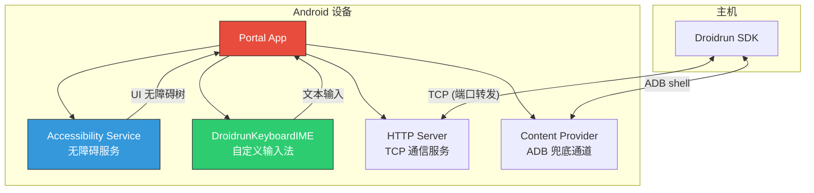

**核心功能**：

| 组件 | 功能 |
| --- | --- |
| **Accessibility Service** | 获取完整的 UI 无障碍树（a11y_tree），包含所有可见元素的属性和层级关系 |
| **DroidrunKeyboardIME** | 自定义输入法，通过 base64 编码处理特殊字符和多语言文本输入 |
| **HTTP Server** | 内置 HTTP 服务器，通过 ADB 端口转发提供快速的 TCP 通信 |
| **Content Provider** | 作为兜底通信方式，通过 ADB shell 命令传输数据 |


### 5.2 双通信通道
Droidrun 设计了主备两条通信通道，确保通信的可靠性：

| 特性 | TCP 通道 | Content Provider 通道 |
| --- | --- | --- |
| **协议** | HTTP（经 ADB 端口转发） | ADB shell 命令 |
| **速度** | 快 | 较慢 |
| **可靠性** | 可能受端口占用影响 | 稳定但效率低 |
| **用途** | 日常通信（优先） | TCP 失败时的兜底方案 |
| **数据传输** | JSON over HTTP | Shell 命令输出 |


通信选择逻辑：

```plain
初始化时检查 DeviceConfig.use_tcp 配置（默认 False）
  -> use_tcp=False -> 直接使用 Content Provider（默认行为）
  -> use_tcp=True  -> 尝试 TCP 通道
                      -> 成功 -> 使用 TCP 通信（运行时若 TCP 失败自动 fallback 到 Content Provider）
                      -> 失败 -> 回退到 Content Provider
```

> 注意：默认不启用 TCP 通道。需显式配置 `use_tcp: true` 或 CLI 使用 `--tcp` 参数后，才会启用 TCP 优先 + Content Provider 兜底的双通道策略。
>

### 5.3 状态重试与恢复
`get_state()` 失败时，框架通过 `fetch_state_with_retry()` 进行**递增延迟重试**：

```plain
最大重试次数: 7
延迟序列: [1s, 2s, 3s, 5s, 8s, 10s]（总等待约 29s）

第 1 次失败: 等待 1s
第 2 次失败: 等待 2s
第 3 次失败: 等待 3s
第 4 次失败: 等待 5s
第 5 次失败: 触发恢复操作（仅执行一次），等待 8s
第 6 次失败: 等待 10s
第 7 次失败: 抛出异常
```

**恢复操作**（在第 5 次失败后触发，约已累计等待 11s）：

1. **重启无障碍服务**：
    - 先关闭无障碍服务（`accessibility_enabled 0`）
    - 等待 0.5s
    - 重新设置服务名并启用
2. **若 TCP 通道在使用中，重启 TCP Socket 服务器**：
    - 先关闭 Socket 服务器
    - 等待 0.3s
    - 再重新开启
3. 等待 1.5s 让服务恢复

> 注意：`DeviceDisconnectedError`（设备断连）不参与重试，会被立即抛出。
>

### 5.4 ToolRegistry 统一分发
所有工具通过注册表统一管理和分发：

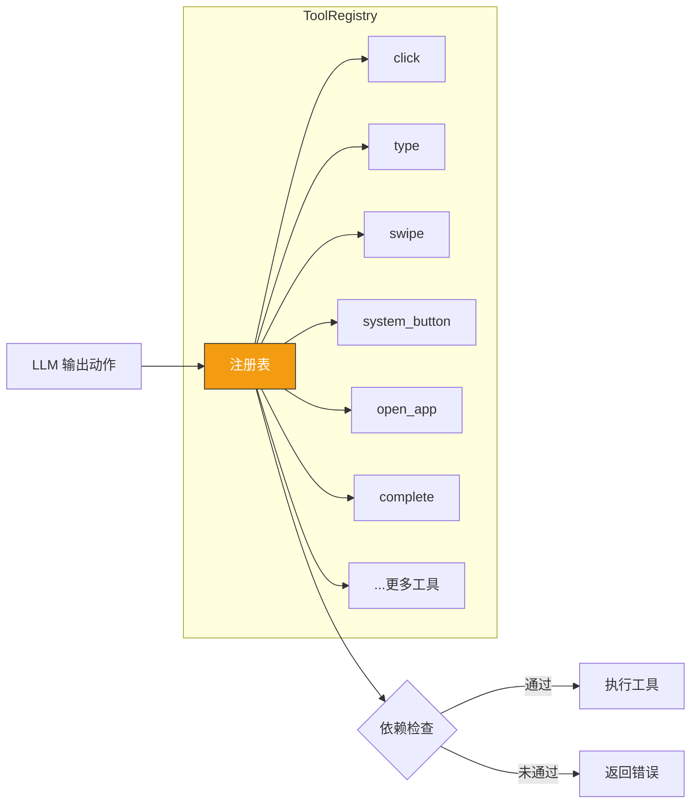

**关键特性**：

+ **统一注册**：所有工具在初始化时注册到 ToolRegistry
+ **初始化时能力检查**：通过 `disable_unsupported(capabilities)` 在初始化阶段一次性移除设备不支持的工具（而非每次执行时检查）
+ **动态禁用**：可在运行时禁用/启用特定工具
+ **签名生成**：自动生成工具签名供 LLM 参考
+ **结果归一化**：`execute()` 将各种返回类型（ActionResult、tuple、str 等）统一归一化为 `ActionResult`

### 5.5 llama-index Workflow 事件驱动编排
Droidrun 基于 llama-index 的 **Workflow 系统** 进行 Agent 编排：

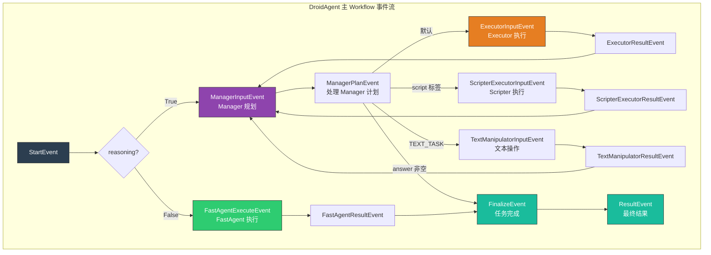

各子 Agent 内部也有独立的 Workflow 事件流：

| 子 Agent | 内部事件流 |
| --- | --- |
| ManagerAgent | `StartEvent → ManagerContextEvent → ManagerResponseEvent → ManagerPlanDetailsEvent → StopEvent` |
| ExecutorAgent | `StartEvent → ExecutorContextEvent → ExecutorResponseEvent → ExecutorActionEvent → ExecutorActionResultEvent → StopEvent` |
| FastAgent | `StartEvent → FastAgentInputEvent → FastAgentResponseEvent → FastAgentToolCallEvent → FastAgentOutputEvent → (循环) → FastAgentEndEvent → StopEvent` |
| CodeActAgent | `StartEvent → CodeActInputEvent → CodeActResponseEvent → CodeActCodeEvent → CodeActOutputEvent → (循环) → CodeActEndEvent → StopEvent` |
| ScripterAgent | `StartEvent → ScripterInputEvent → ScripterThinkingEvent → ScripterExecutionEvent → ScripterExecutionResultEvent → (循环) → ScripterEndEvent → StopEvent` |


**设计优势**：

+ **事件驱动**：各阶段通过事件解耦，便于扩展和测试
+ **嵌套 Workflow**：支持子 Workflow（如 AppStarter），实现复杂流程的模块化
+ **事件流**：支持实时观察事件流，便于调试和监控
+ **异步执行**：基于 Python asyncio，支持并发操作

---

## 六、依赖与技术栈
| 依赖库 | 用途 |
| --- | --- |
| `async_adbutils` | 异步 ADB 通信，连接和操控 Android 设备 |
| `llama-index` | LLM 编排框架，提供 Workflow 系统和 Agent 抽象 |
| `httpx` | 异步 HTTP 客户端，用于与 Portal App TCP 通道通信 |
| `pydantic` | 数据模型验证，确保配置和动作参数的类型安全 |


**支持的 LLM 后端**：

| 提供商 | 说明 |
| --- | --- |
| OpenAI | GPT-4o 等模型 |
| Anthropic | Claude 系列模型 |
| Google Gemini | Gemini Pro/Ultra |
| Ollama | 本地部署的开源模型 |
| DeepSeek | DeepSeek 系列模型 |
| OpenRouter | 多模型聚合路由 |


---

## 七、适用场景与局限
### 适用场景
| 场景 | 说明 |
| --- | --- |
| **自动化 UI 测试** | 通过自然语言描述测试用例，自动执行 UI 测试流程 |
| **重复任务自动化** | 日常重复操作（如每日签到、批量操作）的自动化 |
| **自然语言操控手机** | 对不熟悉手机操作的用户提供语音/文字交互方式 |
| **跨应用工作流** | 涉及多个应用的复杂操作流程自动化 |
| **辅助功能增强** | 为视障等特殊人群提供更直观的设备操作方式 |


### 已知局限
| 局限 | 说明 |
| --- | --- |
| **依赖无障碍服务** | 部分系统/厂商可能限制无障碍服务的使用，或在后台自动关闭 |
| **LLM 延迟** | 每步操作都需要 LLM 推理，网络延迟和模型响应时间累加可能较大 |
| **复杂手势不支持** | 多点触控、捏合缩放等复杂手势暂不支持 |
| **视觉理解受限** | 纯图像内容（无文本标签的 UI）的识别依赖 LLM 视觉能力 |
| **安全限制** | 系统级弹窗（如权限确认）可能无法通过无障碍服务操作 |
| **设备兼容性** | 不同 Android 厂商的定制系统可能存在兼容性差异 |


---

> 文档生成时间：2026-03-19 | 基于 Droidrun 项目源码分析（v0.5.1, commit 98b762d）
>

---

**复查记录**

+ 时间：2026-03-20
+ 发现问题：
    1. 【严重】Section 5.5 事件驱动编排中的事件名称（SetupEvent、SenseEvent、PlanEvent、ActionEvent）在源码中不存在，为虚构名称。实际事件为 ManagerInputEvent、ManagerPlanEvent、ExecutorInputEvent、ExecutorResultEvent、FastAgentExecuteEvent、FinalizeEvent 等
    2. 【严重】Section 4.6 终止条件有误：Reasoning 模式通过 Manager 返回 answer（`<request_accomplished>` 标签）终止，而非 complete() 工具；连续错误不会自动终止任务，仅设置标志传入 Manager 提示词
    3. 【中等】Section 4.4 click_at 归一化坐标范围错误：文档写 0.0~1.0 浮点数，实际为 0~1000 整数（NORMALIZED_MAX=1000）
    4. 【中等】Section 4.2 ConciseFilter 描述不准确：不检查可交互性，仅做屏幕交集和最小尺寸过滤
    5. 【中等】Section 5.3 重试机制描述为"指数退避"不准确：实际为自定义递增序列 [1,2,3,5,8,10]s，7次尝试，第5次失败后触发恢复（含重启无障碍服务+TCP服务器）
    6. 【中等】Section 5.2 双通道默认行为描述有误：默认 use_tcp=False，即默认仅使用 Content Provider
    7. 【中等】Section 5.4 ToolRegistry 依赖检查时机有误：实际在初始化阶段一次性完成，而非每次 execute() 时检查
    8. 【中等】element_search.py Filters 类方法列表不完整：遗漏 non_clickable、focused、size_matches、contains_descendants、has_text、index、compose、intersect 共 8 个方法
    9. 【中等】遗漏多个 Agent 角色：StatelessManagerAgent、TextManipulatorAgent 未提及
    10. 【低】type() 函数遗漏 clear 参数和 index=-1 跳过聚焦条件
    11. 【低】遗漏操作：long_press_at、wait、remember、type_secret
    12. 【低】Manager 输出字段不完整：遗漏 answer、memory_update、success
    13. 【低】截图获取方式：TCP 模式用 Portal HTTP /screenshot，fallback 用 ADB screencap，不使用 Content Provider
+ 修改内容：
    1. 重写 Section 5.5 事件驱动编排，使用源码中实际的事件类名和流转逻辑，补充子 Agent 内部事件流
    2. 重写 Section 4.6 终止条件，区分 Reasoning 和 Direct 模式的不同终止机制
    3. 修正 click_at 归一化坐标范围为 0~1000 整数
    4. 修正 ConciseFilter 和 DetailedFilter 描述
    5. 重写 Section 5.3 重试机制，使用实际的延迟序列和恢复操作细节
    6. 修正 Section 5.2 双通道默认行为，补充 use_tcp 配置说明
    7. 修正 Section 5.4 ToolRegistry 依赖检查为初始化阶段一次性完成
    8. 补全 Filters 类方法列表（22 个方法），修正参数类型为 ElementFilter
    9. 补充 StatelessManagerAgent 和 TextManipulatorAgent 描述
    10. 补充 type() 的 clear 参数和 index=-1 条件
    11. 补充 long_press_at、wait、remember、type_secret 操作
    12. 补全 Manager 输出字段
    13. 修正截图获取方式描述
    14. 更新初始化阶段描述，反映 iOS 支持、MCP 工具集成、子 Agent 注入等实际逻辑
    15. 更新 Agent 角色对比表

